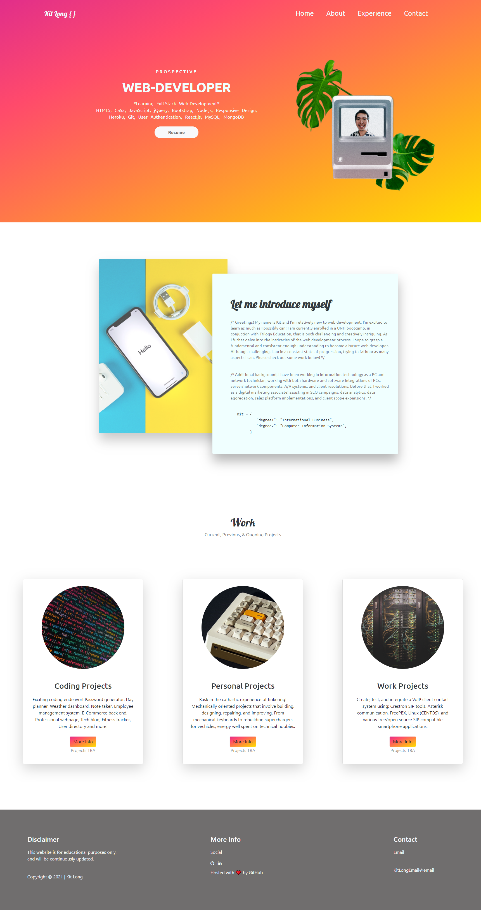

# Kits-Portfolio-Webpage

## About the webpage portfolio:

  The purpose of this was to create and learn:

  1. Portfolio webpage creation/design.
  3. Create a user story scenerio.
  4. Outline and wireframe a page to create.
  ~~5. Prototype page.~~
  6. Fullfill information criteria for the page (resume type items on the individual).
  7. Link items within the page.
  8. Create > stylize > test > debug > edit > (make responsive: ongoing) > revisit.
  9. Deploy a GitHub pages with the content pushed.

## Built With: 

  * HTML
  * CSS
  * Bootstrap
  * ~~Javascript~~ will implement later

## Use: 

  Used to practice building a website/personal portfolio page and layout. This was mainly to showcase projects and information of the prospective hire.
  
  **This was also used to fulfill an interest learning Bootstrap! There was a significant knowledge gap, but countless hours online, watching video tutorials, research, more tutorials, trial/error, and more searching; skills were gained! There is still a long road ahead and countless more hours of learning, but the bootstrap introduction was great!**
  
## Roadmap:

  This page will be constantly updated with subsequent iterations and changes! As more learning transpires, there will be more and more edits/revisions!
  
  * Javascript additions
  * More responsive fixes
  * Additional sections
  * Layout changes
  * Animations
  * Bug fixes
  
## Contact:
  
  * Homework link: https://github.com/kitclong/Kit-s-Portfolio-Webpage
  * GitHub Pages: https://
  
## Acknowledgments:
  * Getbootstrap
  * Font Awesome
  * Google fonts
  * Kapwing editor
  * PicsArt
  * Unsplash
  * Github
  * Github Pages
  * Trilogy Education Services
